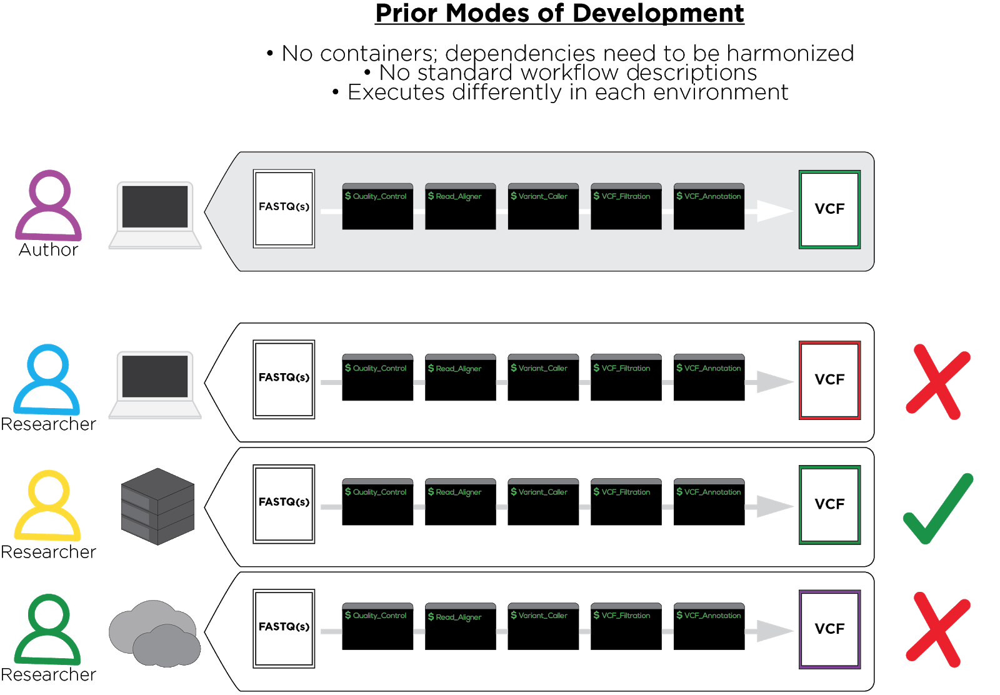
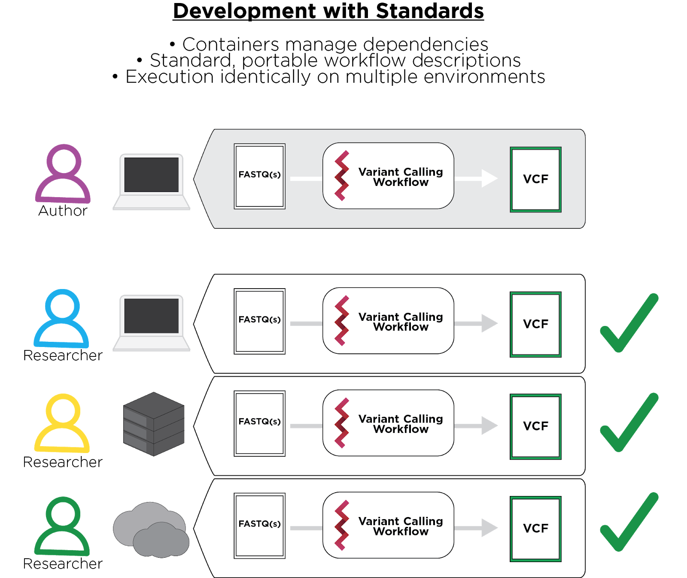

```{r, echo=FALSE}
knitr::opts_chunk$set(
  collapse = TRUE,
  comment = "#>"
)
```

# Instructors and contact information
* [Marko Zecevic](https://github.com/markozecevic) (marko.zecevic@sbgenomics.com)
* [Daniela Cassol](https://github.com/dcassol) (danielac@ucr.edu) 
* [Qiang Hu](https://github.com/hubentu) (Qiang.Hu@roswellpark.org)

# Workshop Description
<!--
Put together some phrases. Need to describe better
-->
This workshop introduces how to use Common Workflow Language (CWL) in different perspectives. The *Rcwl* and *RcwlPipelines* packages which is built on top of the Common Workflow Language (CWL), it will provide a simple and easy way to wrap command line tools and build data analysis pipelines in R using CWL. Also, *systemPipeR* will demonstrate how workflows can be run from a single specification instance either entirely from within R, from various command-line wrappers (e.g., cwl-runner) or from other languages (e.g., Bash or Python). We will present a guide and best practices for creating container images (Docker) out of your R scripts, wrapping them in the *CWL* and then sharing them with the wider world.

## Pre-requisites
- Basic knowledge of R and usage of Bioconductor packages for NGS analysis
- Basic knowledge of running command-line software
- No prior experience with CWL is necessary!

## Workshop Participation
Participants will be able to perform all analysis components of this workshop hands-on. Active user participation throughout the event is highly encouraged including but not limited to lecture material, hands-on sections and final discussion. 

## _R_ / _Bioconductor_ packages used
* [`docopt`](https://github.com/docopt/docopt.R)
* [`sevenbridges`](https://bioconductor.org/packages/release/bioc/html/sevenbridges.html)
* [`Rcwl`](https://bioconductor.org/packages/release/bioc/html/Rcwl.html)
* [`RcwlPipelines`](https://bioconductor.org/packages/release/bioc/html/RcwlPipelines.html)
* [`systemPipeR`](http://www.bioconductor.org/packages/release/bioc/html/systemPipeR.html)
* [`systemPipeRdata`](http://www.bioconductor.org/packages/release/data/experiment/html/systemPipeRdata.html)

### Installation

#### System dependencies

#### R Packages
The [Bioconductor](http://www.bioconductor.org/) R Packages can be installed from the R console using the [_`BiocManager::install`_](https://cran.r-project.org/web/packages/BiocManager/index.html) command. The associated package for this Workshop [_`BioC19CWL`_](https://github.com/hubentu/BioC19CWL) can be installed directly from GitHub, as demonstrated below. The latter provide the samples demo data and all the parameter files required to test and run these examples quickly.

```{r install, eval=FALSE}
if (!requireNamespace("BiocManager", quietly=TRUE)) install.packages("BiocManager")
BiocManager::install(c("systemPipeR", "systemPipeRdata", "Rcwl", "RcwlPipelines"))
```

##### Loading packages 

```{r packages, eval=TRUE}
# Loads the packages
suppressPackageStartupMessages({
library(systemPipeR)
library(systemPipeRdata)
library(Rcwl)
library(RcwlPipelines)
})
```

## Time outline
| Activity                                     | Instructor     | Time |
|----------------------------------------------|----------------|------|
| Introduction to CWL                          | Marko Zecevic  | 10m  |
| Turning your script into a command line tool | Marko Zecevic  | 30m  |
| Rcwl to wrap Bioinformatics tools            | Qiang Hu       | 10m  |
| Write your pipeline with Rcwl                | Qiang Hu       | 20m  |
| Case study                                   | Qiang Hu       | 10m  |
| systemPipeR                                  | Daniela Cassol | 40m  |

# Workshop goals and objectives

## Learning goals
* Integration of command-line tools via the CWL community standard
* Design of CWL workflows
* Understand how to wrap tools with `Rcwl`
* Practice to build pipeline
* ...

## Learning objectives
* How to make analysis workflows more robust, reproducible and portable across heterogeneous computing systems
* Create a basic `echo` tool
* Build a simple DNASeq alignment pipeline
* Usage of new CWL S4 class in *systemPipeR*
* ...

# Introduction to CWL

Biomedical data analysis workflows created using ad hoc methods are not easily sharable or reproducible, which can result in inconsistencies when attempting to replicate scientific results and publications or perform collaborative analyses. 

<center>


</center>

To overcome these challenges, the bioinformatics community is embracing the use of software containers such as Docker and workflow description languages for easier documentation and replication of analysis pipelines.

Software containers enable easy packaging and sharing of command line tools and bioinformatics applications. Docker containers simplified how we share software, because they neatly package binaries and libraries together with their apps, and run them in a virtual environment directly on top of the host OS. That makes them much smaller, more portable and less computationally intense than virtural machines. However, containers do not come with instructions on how to execute these applications in a fashion that is human and machine-readable, enabling automation, scaling and reproducibility. 

The Common Workflow Language (CWL), established in 2014, is a community-developed and widely adopted specification for describing containerized tools and workflows with plain text documents in a way that facilitates all the things we mentioned above. Applications described with Docker images and CWL will run consistently, in the way you intend, on everything from your local computer, your HPC, to your cloud infrastructure and various cloud platforms.

<center>


</center>

CWL can be written in easily readable and parsable YAML, or a bit less readable, but just as parsable JSON - or a combination of both! It allows for extensions and tooling that facilitate code development, testing, and execution. One such set of tools is the Rabix project from Seven Bridges (Rabix.io), an open-source project that enables rapid composition and execution of CWL workflows in a manner that is scalable and reproducible.

Included in CWL tool or workflow description:

* CWL version
* All commands necessary to run tool(s)
* References to containers containing the tools with all dependencies

```
cwlVersion: v1.0
class: CommandLineTool
baseCommand: echo
inputs:
  message:
    type: string
    inputBinding:
      position: 1
outputs: []
```

CWL requires executors or workflow engines to interpret and execute.

## Usecase

Perhaps you are a researcher analyzing a dataset using Bioconductor tools and are planning to share your methods and findings with the world. You want your analysis to be reproducible so that once it's published, anyone with the access to the input data can repeat everything you've done and produce exactly the same outputs.

To illustrate, we will be using a short DESeq2-based script as an example:

```{r deseq2 script, eval=FALSE}
library(DESeq2)
library(pasilla)
library(ReportingTools)

directory <- system.file("extdata", package="pasilla", mustWork=TRUE)
sampleFiles <- grep("treated", list.files(directory), value=TRUE)
phenoCSV = read.csv(file.path(directory, "pasilla_sample_annotation.csv"))
designFormula <- "~type + condition"

sampleTable <- data.frame(fileName = sampleFiles, 
                          filePath = file.path(directory, sampleFiles), 
                          stringsAsFactors = FALSE)

ind <- match(phenoCSV[,1], tools::file_path_sans_ext(sampleTable$fileName))
sampleTable <- sampleTable[ind, , drop = FALSE]
sampleTable <- cbind(sampleTable, phenoCSV)
sampleTable <- sampleTable[complete.cases(sampleTable),]
fctr <- trimws(tail(strsplit(designFormula, "\\+")[[1]], n=1))

dds <- DESeqDataSetFromHTSeqCount(sampleTable = sampleTable,
                                  directory = "",
                                  design =  as.formula(designFormula))

dds <- DESeq(dds)

des2Report <- HTMLReport(shortName = 'DESeq2_analysis',
                         title = 'DESeq2 DE analysis on pasilla data',
                         reportDirectory = "./reports")

publish(dds, des2Report, pvalueCutoff = 0.05,
        factor = colData(dds)[,fctr],
        reportDir="./reports")

finish(des2Report)
```

In the example above, the input files used come from the [pasilla package](http://bioconductor.org/packages/release/data/experiment/html/pasilla.html). If there is a chance you or someone else will be running a similar analysis in the future, then it may be a good idea to limit the “hard-coding” of inputs and parameters and instead provide them at runtime via command-line arguments.

## The command-line interface

The first thing one needs to do in order to wrap his R/Bioconductor script into a neat portable CWL package is define the command-line interface. This can be done easily by using the R implementation of [docopt](http://docopt.org/). With docopt, by providing your script with a help message, you are at the same time defining its command line interface.

See the re-worked script below:

```{r docopt, eval=FALSE}
'Docopt example

Usage: 
    exscrDoc.R --counts <file>... --phenodata <file> --factor <string> [--control <string>...]
    
Options:
    
    --counts <file>     Gene counts, one file per sample.
    --phenodata <file>  Phenotype data in CSV format.
    --factor <string>   Covariate of interest.
    --control <string>  Optional parameters representing names of potential 
                        confounders To be included in the design formula. 
                        Must correspond to column names in the pheno data CSV.
' -> doc

library(docopt)
opts <- docopt(doc)

library(DESeq2)
library(pasilla)
library(ReportingTools)

directory <- ""

sampleFiles <- opts$counts
phenoCSV = read.csv(opts$phenodata)


designFormula <- paste0("~",paste(c(opts$control, opts$factor), collapse = '+'))

sampleTable <- data.frame(fileName = basename(sampleFiles), 
                          filePath = sampleFiles, 
                          stringsAsFactors = FALSE)

ind <- match(phenoCSV[,1], tools::file_path_sans_ext(sampleTable$fileName))
sampleTable <- sampleTable[ind, , drop = FALSE]
sampleTable <- cbind(sampleTable, phenoCSV)
sampleTable <- sampleTable[complete.cases(sampleTable),]

dds <- DESeqDataSetFromHTSeqCount(sampleTable = sampleTable,
                                  directory = directory,
                                  design =  as.formula(designFormula))

dds <- DESeq(dds)

des2Report <- HTMLReport(shortName = 'DESeq2_analysis',
                         title = 'DESeq2 DE analysis on pasilla data',
                         reportDirectory = "./reports")

publish(dds, des2Report, pvalueCutoff = 0.05,
        factor = colData(dds)[,opts$factor],
        reportDir="./reports")

finish(des2Report)
```

Now the script can be executed from the command line like this:

```{r, engine='bash', eval=FALSE}
Rscript exscrDoc.R --counts /Library/Frameworks/R.framework/Versions/3.5/Resources/library/pasilla/extdata/treated1fb.txt --counts /Library/Frameworks/R.framework/Versions/3.5/Resources/library/pasilla/extdata/treated2fb.txt --counts /Library/Frameworks/R.framework/Versions/3.5/Resources/library/pasilla/extdata/treated3fb.txt --counts /Library/Frameworks/R.framework/Versions/3.5/Resources/library/pasilla/extdata/untreated1fb.txt --counts /Library/Frameworks/R.framework/Versions/3.5/Resources/library/pasilla/extdata/untreated2fb.txt --counts /Library/Frameworks/R.framework/Versions/3.5/Resources/library/pasilla/extdata/untreated3fb.txt --counts /Library/Frameworks/R.framework/Versions/3.5/Resources/library/pasilla/extdata/untreated4fb.txt --phenodata /Library/Frameworks/R.framework/Versions/3.5/Resources/library/pasilla/extdata/pasilla_sample_annotation.csv --factor condition --control type
```

## Dockerizing

```{}
FROM bioconductor/release_base2:R3.6.0_Bioc3.9

# installing required R packages
RUN R -e 'BiocManager::install("DESeq2")'
RUN R -e 'BiocManager::install("ReportingTools")'

COPY Dockerfile /opt/

```

# Rcwl
## Introduction to Rcwl
### Rcwl setup
The `Rcwl` package is aimed to a simple and user-friendly way to manage command line tools and build data analysis pipelines in R using Common Workflow Language (CWL). The `Rcwl` and `RcwlPipelines` packages are available in Bioc 3.7 and R >= 3.6. You can install them by the `BiocManager` package.
```{r}
if (!requireNamespace("RcwlPipelines", quietly = TRUE))
	BiocManager::install(c("Rcwl", "RcwlPipelines"))
library(Rcwl)
library(RcwlPipelines)
```

### System requirements

Besides the depedencies of the R packages, the following tools are required to be installed to run the .

* cwltool (>= 1.0.2018)
* nodejs
* Docker (optional)

The `cwltool` is the reference implementation of the Common Workflow Language, which is used to run the CWL scripts. The `nodejs` is required when the CWL scripts use JavaScript language. The Docker containers simplify software installation and management. A CWL runner can pull the required Docker containers automatically and adjusting the paths of input files.

Here you can find instruction to install these tools.

* <https://github.com/common-workflow-language/cwltool#install>
* <https://nodejs.org>
* <https://docs.docker.com/install>

## First example
### Hello world
The main class and constructor function is `cwlParam`, which wrap a command line tool and its parameters in a `cwlParam` object. Let's start with a simple example, `echo hello world`.

First, we load the package and then define the input parameter for "echo", a string without a prefix. Just an `id` option required.

```{r}
input1 <- InputParam(id = "sth")
```

Second, create a `cwlParam` object with `baseCommand` for the command to execute and `InputParamList` for the input parameters.
```{r}
echo <- cwlParam(baseCommand = "echo", inputs = InputParamList(input1))
```

Now we have a command object to run. Let's send a string "Hello World!" to the object. Without defining the outputs, it will stream standard output to a temporary file by default.
```{r}
echo$sth <- "Hello World!"
echo
```

### Test run
The function `runCWL` is used to run the CWL object by invoking the python tool `cwltool`. The return will be a list including the command executed, temporary output and logs. The output directory is the current folder by default, but it can be changed by setting `outdir` option. All standard out and standard error stream can also be printed by setting `stderr = ""`.
```{r}
r1 <- runCWL(echo, outdir = tempdir())
r1
```

Here we can check the output to ensure the code did what we expected.
```{r}
r1$output
readLines(r1$output)
```

The executed command was returned in the result list. It shows the command that we defined to run.
```{r}
r1$command
```

The log shows the details of how the `cwltool` works with CWL scripts.
```{r}
r1$log
```
The `runCWL` generated two scripts with the default `tempfile` prefix, the tool wrapper CWL file and the input YML file. The `cwltool` parse the two scripts and translate them to the command shown before. The output is not defined in the `cwlParam` object, so the command output was returned to __stdout__ by default.

## Components
### Input Parameters
1. Essential Input parameters
For the input parameters, three options need to be defined usually, *id*, *type*, and *prefix*. The type can be *string*, *int*, *long*, *float*, *double*, and so on. More detail can be found at: <https://www.commonwl.org/v1.0/CommandLineTool.html#CWLType>.

Here is an example from [CWL user guide](http://www.commonwl.org/user_guide/03-input/). Here we defined an `echo` with different type of input parameters by `InputParam`. The `stdout` option can be used to caputre the standard output stream to a file.

```{r}
e1 <- InputParam(id = "flag", type = "boolean", prefix = "-f")
e2 <- InputParam(id = "string", type = "string", prefix = "-s")
e3 <- InputParam(id = "int", type = "int", prefix = "-i")
e4 <- InputParam(id = "file", type = "File", prefix = "--file=", separate = FALSE)
echoA <- cwlParam(baseCommand = "echo",
                  inputs = InputParamList(e1, e2, e3, e4),
                  stdout = "output.txt")
```

Then we give it a try by setting values for the inputs.
```{r}
echoA$flag <- TRUE
echoA$string <- "Hello"
echoA$int <- 1

tmpfile <- tempfile()
write("World", tmpfile)
echoA$file <- tmpfile

r2 <- runCWL(echoA, outdir = tempdir())
r2$command
```

2. Array Inputs
A similar example to CWL user guide. We can define three different type of array as inputs. 
```{r}
a1 <- InputParam(id = "A", type = "string[]", prefix = "-A")
a2 <- InputParam(id = "B",
                 type = InputArrayParam(items = "string",
                                        prefix="-B=", separate = FALSE))
a3 <- InputParam(id = "C", type = "string[]", prefix = "-C=",
                 itemSeparator = ",", separate = FALSE)
echoB <- cwlParam(baseCommand = "echo",
                 inputs = InputParamList(a1, a2, a3))
```

Then set values for the three inputs.
```{r}
echoB$A <- letters[1:3]
echoB$B <- letters[4:6]
echoB$C <- letters[7:9]
echoB
```

Now we can check whether the command behaves as we expected.
```{r}
r3 <- runCWL(echoB, outdir = tempdir())
r3$command
```

### Output Parameters
1. Capturing Output
The outputs, similar to the inputs, is a list of output parameters. Three options *id*, *type* and *glob* can be defined. The glob option is used to define a pattern to find files relative to the output directory.

Here is an example to unzip a compressed `gz` file. First, we generate a compressed R script file.
```{r}
zzfil <- file.path(tempdir(), "sample.R.gz")
zz <- gzfile(zzfil, "w")
cat("sample(1:10, 5)", file = zz, sep = "\n")
close(zz)
```

We define a `cwlParam` object to use "gzip" to uncompress a input file.
```{r}
ofile <- "sample.R"
z1 <- InputParam(id = "uncomp", type = "boolean", prefix = "-d")
z2 <- InputParam(id = "out", type = "boolean", prefix = "-c")
z3 <- InputParam(id = "zfile", type = "File")
o1 <- OutputParam(id = "rfile", type = "File", glob = ofile)
gz <- cwlParam(baseCommand = "gzip",
               inputs = InputParamList(z1, z2, z3),
               outputs = OutputParamList(o1),
               stdout = ofile)
```

Now the `gz` object can be used to uncompress the previous generated compressed file.
```{r}
gz$uncomp <- TRUE
gz$out <- TRUE
gz$zfile <- zzfil
r4 <- runCWL(gz, outdir = tempdir())
r4$output
```

Or we can use `arguments` to set some default parameters.
```{r}
z1 <- InputParam(id = "zfile", type = "File")
o1 <- OutputParam(id = "rfile", type = "File", glob = ofile)
Gz <- cwlParam(baseCommand = "gzip",
               arguments = list("-d", "-c"),
               inputs = InputParamList(z1),
               outputs = OutputParamList(o1),
               stdout = ofile)
Gz
Gz$zfile <- zzfil
r4a <- runCWL(Gz, outdir = tempdir())
```

To make it for general usage, we can define a pattern with javascript to glob the output, which require `node` to be installed in your system PATH.
```{r}
pfile <- "$(inputs.zfile.path.split('/').slice(-1)[0].split('.').slice(0,-1).join('.'))"
```

Or we can use the CWL built in file property, `nameroot`, directly.
```{r}
pfile <- "$(inputs.zfile.nameroot)"
o2 <- OutputParam(id = "rfile", type = "File", glob = pfile)
req1 <- list(class = "InlineJavascriptRequirement")
GZ <- cwlParam(baseCommand = c("gzip", "-d", "-c"),
               requirements = list(), ## assign list(req1) if node installed.
               inputs = InputParamList(z1),
               outputs = OutputParamList(o2),
               stdout = pfile)
GZ$zfile <- zzfil
r4b <- runCWL(GZ, outdir = tempdir())
```

2. Array Outputs

We can also capture multiple output files with `glob` pattern.
```{r}
a <- InputParam(id = "a", type = InputArrayParam(items = "string"))
b <- OutputParam(id = "b", type = OutputArrayParam(items = "File"), glob = "*.txt")
touch <- cwlParam(baseCommand = "touch", inputs = InputParamList(a), outputs = OutputParamList(b))
touch$a <- c("a.txt", "b.gz", "c.txt")
r5 <- runCWL(touch, outdir = tempdir())
r5$output
```

## Run approaches
### Running Tools in parallel

The CWL also can work in high performance clusters with batch-queuing system, such as SGE, PBS, SLURM and so on, using the Bioconductor package `BiocParallel`. Here is an example to submit jobs with "Multiicore" and "SGE".

```{r, eval=FALSE}
library(BiocParallel)
sth.list <- as.list(LETTERS)
names(sth.list) <- LETTERS

## submit with mutlicore
result1 <- runCWLBatch(cwl = echo, outdir = tempdir(), inputList = list(sth = sth.list),
                       BPPARAM = MulticoreParam(4))

## submit with SGE
result2 <- runCWLBatch(cwl = echo, outdir = tempdir(), inputList = list(sth = sth.list),
                       BPPARAM = BatchtoolsParam(workers = 4, cluster = "sge",
                                                 resources = list(queue = "all.q")))
```

### Web Application
Here we build a tool with different types of input parameters.
```{r}
e1 <- InputParam(id = "flag", type = "boolean",
                 prefix = "-f", doc = "boolean flag")
e2 <- InputParam(id = "string", type = "string", prefix = "-s")
e3 <- InputParam(id = "option", type = "string", prefix = "-o")
e4 <- InputParam(id = "int", type = "int", prefix = "-i", default = 123)
e5 <- InputParam(id = "file", type = "File",
                 prefix = "--file=", separate = FALSE)
e6 <- InputParam(id = "array", type = "string[]", prefix = "-A",
                 doc = "separated by comma")
mulEcho <- cwlParam(baseCommand = "echo", id = "mulEcho",
                 label = "Test parameter types",
                 inputs = InputParamList(e1, e2, e3, e4, e5, e6),
                 stdout = "output.txt")
mulEcho
```

Some input parameters can be predefined in a list, which will be
converted to select options in the webapp. An `upload` parameter can
be used to defined wether to generate an upload interface for the file
type option. If FALSE, the upload field will be text input (file path)
instead of file input.

```{r, eval=FALSE}
inputList <- list(option = c("option1", "option2"))
app <- cwlShiny(mulEcho, inputList, upload = TRUE)
runApp(app)
```

 

## Wrap R command-line tool

Let's wrap the previous "exscrDoc.R" with `Rcwl`.
```{r}
sysdir <- system.file(package="BioC19CWL")
rtool <- file.path(sysdir, "testdata/exscrDoc.R")
p1 <- InputParam(id = "counts",
                 type = InputArrayParam(items = "File",
                                        prefix = "--counts"))
p2 <- InputParam(id = "phenodata", type = "File",
                 prefix = "--phenodata")
p3 <- InputParam(id = "factor", type = "string", prefix = "--factor")
p4 <- InputParam(id = "control", type = "string", prefix = "--control")
o1 <- OutputParam(id = "outdir", type = "Directory", glob = "reports")
DE <- cwlParam(baseCommand = c("Rscript", rtool),
               inputs = InputParamList(p1, p2, p3, p4),
               outputs = OutputParamList(o1))
```

To test the tool using data from the "pasilla" package.
```{r, eval=TRUE}
DE$counts <- list.files(system.file("extdata", package = "pasilla"),
                        "treat", full.names = TRUE)
DE$phenodata <- system.file("extdata/pasilla_sample_annotation.csv",
                            package = "pasilla")
DE$factor <- "condition"
DE$control <- "type"
DEres <- runCWL(DE, outdir = tempdir())
```

Here are the command and results:
```{r}
head(DEres$command, n=22)
head(DEres$output)
```

## Build a simple DNASeq pipeline
### RcwlPipelines

The R scripts to build the CWL tools and pipelines based on the `Rcwl`
package are stored in the "tools" and "pipelines" folder respectively.
The function `cwlTools` can be used to collect the available scripts.
The `cachePath` can be your existing cache directory or a new folder.

```{r}
tools <- cwlTools(cachePath = tempdir())
tools
```

The full paths can be pulled from the "fpath" column.
```{r, messange=FALSE}
library(dplyr)
bfcinfo(tools) %>% select(rname, fpath)
```

### Build a pipeline
We can develop a pipline by utilizing the available tools. For
example, a simple alignment pipelines with mapping and marking
duplicates can be built from the `tools`.

First, we load the required tools, bwa, samtools and picard
markduplicates.

```{r}
scripts <- bfcinfo(tools) %>%
    filter(rname %in% c("bwa",
                        "samtools_samTobam",
                        "samtools_sortBam",
                        "samtools_index",
                        "markdup")) %>%
    pull(rpath)
invisible(sapply(scripts, source))
```

Next, we define the input parameters.
```{r}
p1 <- InputParam(id = "threads", type = "int")
p2 <- InputParam(id = "RG", type = "string")
p3 <- InputParam(id = "Ref", type = "File",
                 secondaryFiles =
                     c(".amb", ".ann", ".bwt", ".pac", ".sa"))
p4 <- InputParam(id = "FQ1", type = "File")
p5 <- InputParam(id = "FQ2", type = "File?")
```

Then we define the pipeline steps, from raw fastqs to duplicates
marked alignments.

```{r}
## bwa
s1 <- Step(id = "bwa", run = bwa,
           In = list(threads = "threads",
                     RG = "RG",
                     Ref = "Ref",
                     FQ1 = "FQ1",
                     FQ2 = "FQ2"))
## sam to bam
s2 <- Step(id = "sam2bam", run = sam2bam,
           In = list(sam = "bwa/sam"))
## sort bam
s3 <- Step(id = "sortBam", run = sortBam,
           In = list(bam = "sam2bam/bam"))
## mark duplicates
s4 <- Step(id = "markdup", run = markdup,
           In = list(ibam = "sortBam/sbam",
                     obam = list(
                         valueFrom="$(inputs.ibam.nameroot).mdup.bam"),
                     matrix = list(
                         valueFrom="$(inputs.ibam.nameroot).markdup.txt")))
## index bam
s5 <- Step(id = "idxBam", run = samtools_index,
           In = list(bam = "markdup/mBam"))
```

Last, we define the outputs and connect the steps to a new pipeline.
```{r}
req1 <- list(class = "StepInputExpressionRequirement")
req2 <- list(class = "InlineJavascriptRequirement")
## outputs
o1 <- OutputParam(id = "Bam", type = "File", outputSource = "markdup/mBam")
o2 <- OutputParam(id = "Idx", type = "File", outputSource = "idxBam/idx")
## stepParam
Align <- cwlStepParam(requirements = list(req1, req2),
                      inputs = InputParamList(p1, p2, p3, p4, p5),
                      outputs = OutputParamList(o1, o2))
## build pipeline
Align <- Align + s1 + s2 + s3 + s4 + s5
```

The pipeline is ready for use. We can plot the pipeline with
`plotCWL` from the `Rcwl` package.
```{r}
plotCWL(Align)
```

Let's run the pipeline.
```{r, eval=FALSE}
library(BiocParallel)
ids <- c("normal", "tumor")
fq1 <- list.files(file.path(sysdir, "testdata"), "1.fq.gz", full.names = TRUE)
fq2 <- list.files(file.path(sysdir, "testdata"), "2.fq.gz", full.names = TRUE)
fq1 <- as.list(fq1)
fq2 <- as.list(fq2)
rg <- as.list(paste("@RG",
                    paste0("ID:", ids),
                    paste0("SM:", ids), sep = "\\t"))
names(fq1) <- names(fq2) <- names(rg) <- ids

inputList <- list(RG = rg,
                  FQ1 = fq1,
                  FQ2 = fq2)
paramList <- list(threads = 2,
                  Ref = file.path(sysdir, "testdata/ref.fa"))

result <- runCWLBatch(cwl = Align, outdir = tempdir(), inputList,
                      paramList, BPPARAM = MulticoreParam(2),
                      stderr = "", cwlTemp=TRUE)
```

Check the results:
```{r, eval=FALSE}
dir(file.path(tempdir(), "normal"))
```

# systemPipeR
